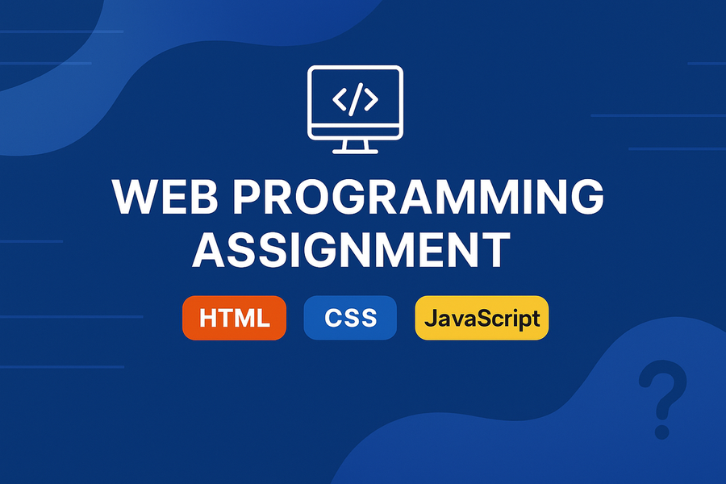

# Web-Programming



# 🌐 Web Programming Assignment

[]()
[]()
[]()
[]()

> 📚 **Course:** **Web Programming**  
> 🏫 **Institution:** **BML Munjal University**  
> 👨‍🏫 **Instructor:** **Navyumm**

---

## 📌 Overview

This repository contains my **Web Programming** course assignment.  
It demonstrates the assignment's I would complete thorugh out this course and this semester.

---

- 📅 Assignment Date / Submission Date – 12/08/2025.
- 📝 Learning Outcomes – Learned how to use heading and add a image to the HTML file.
- 📋 Assignment Requirements – Create a simple profile page with your name, a heading, an image, and a short paragraph about yourself.
- 🎯 Future Improvements – I plan to use particle.js to make it more attractive and use node.js for some parts too.
- 📜 License – No license

---

## 🗂 Project Structure
📂 assignment-folder```
|── 📄 assignment.html → Main HTML file
|── 🎨 a.css → CSS styles```

---

## 🚀 Features 
✅ Clean and semantic HTML structure  
✅ Well-organized and reusable CSS  

---

## 🛠 Technologies Used
- **HTML5**
- **CSS**

---

## 📄 How to Run

1️⃣ **Clone the repository:**
```bash
git clone https://github.com/SUPGAMI2361/Web-Programming.git

2️⃣ **Navigate into the folder:**
cd Web-Programming

3️⃣ **Open assignment.html in your browser.

---
📌 Notes

This project is part of my coursework and is intended for educational purposes.
Feel free to explore, but please do not copy directly for your own submissions.
---